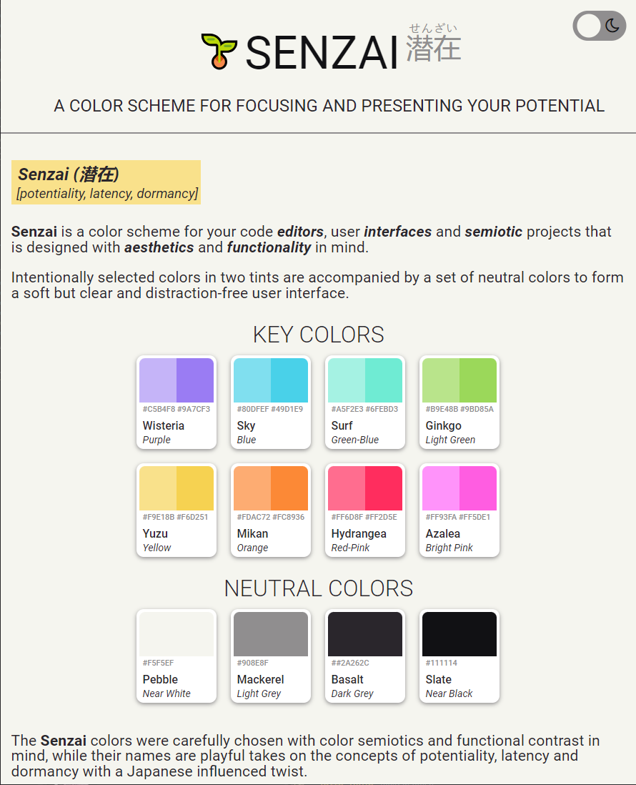

  <ul align="center" style="list-style: none;">
    

      <h1>🌱Senzai</h1>
      <h2>(潜在)</h2>
       
      <h2><b>A color scheme for focusing and presenting your potential</b></h2>
    

  </ul>

  
[![Stargazers][stars-shield]][stars-url] [![Contributors][contributors-shield]][contributors-url] [![License][license-shield]][license-url] 

<b>Senzai is a color scheme for your code editors, user interfaces and semiotic projects that is designed with aesthetics and functionality in mind. Intentionally selected colors in two tints are accompanied by a set of neutral colors to form a soft but clear and distraction-free user interface.</b>
  

  

  

<i>This is the repository for the Senzai color scheme webpage and files.

To learn more about Senzai, click the button above!</i>

---

[contributors-shield]: https://img.shields.io/github/contributors/lottehime/senzai-theme.svg?colorA=2A262C&colorB=A5F2E3&style=for-the-badge
[contributors-url]: https://github.com/lottehime/senzai-theme/graphs/contributors

[stars-shield]: https://img.shields.io/github/stars/lottehime/senzai-theme.svg?colorA=2A262C&colorB=F9E18B&style=for-the-badge
[stars-url]: https://github.com/lottehime/senzai-theme/stargazers

[license-shield]: https://img.shields.io/github/license/lottehime/senzai-theme.svg?colorA=2A262C&colorB=80DFEF&style=for-the-badge
[license-url]: https://github.com/lottehime/senzai-theme/blob/master/LICENSE.txt

